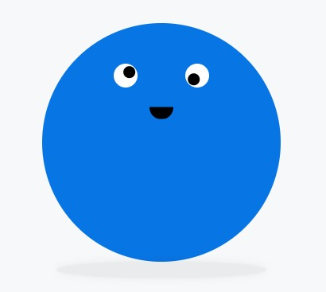

# New Starting Style 🍍
Using new @starting-style CSS.
Ejercicio aplicando el @starting-style de CSS.

---
## Table of contents

- [New Starting Style 🍍](#new-starting-style)
  - [Table of contents](#table-of-contents)
  - [Views](#Views)
    - [About New](#about-new)
    - [Color Generator](#color-generator)
    - [Pineapple](#pineapple)

## Views

### About New
- Official documentation to new starting style.

### Color Generator
- Generator of random colors to discover.

### Pineapple 👻
- Halloween pineapple surprise.

## My process 🛠

- hi
- hi
- hi
- hi

## Author 🤵

- hi
- hi
- hi
- hi

### Screenshot 

## Principales directorios

### Codigo fuente(contoladores,modelos y acceso de base de datos)

### src/Connection (Opción recomendable para conectar a base de datos)
### src/Controllers
### src/Controllers
### src/DTOS
### src/Models
### src/Repositories
### src/Services

---
## Manejo de Sessiones

Descripción: Uso de sessiones de manera global durante todo el proyecto en donde se necesite verificar session activa de usuarios; implementa tiempo de session de 60 minutos transcurrido ese lapso de tiempo caduca la sessión y es necesario nuevamente ingresar. Tiene la capacidad de guardar sessiones de cualquier tipo incluyedo al usuario autenticado.

---
## Partials:

**Finalidad**: Si alguna de estas secciones cambia no afecte en ninguna pantalla(vista y/o página).

Ruta: partials/header-menu.php

