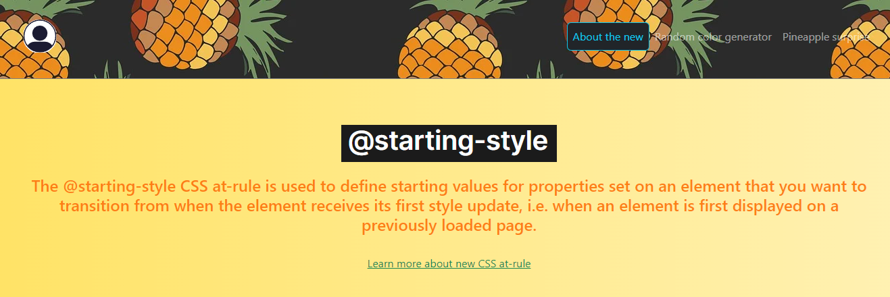
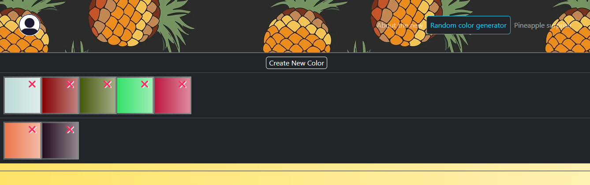
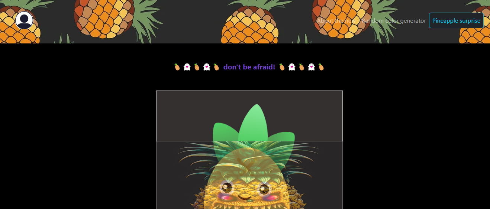

# New Starting Style 🍍
- Using new @starting-style CSS.
- Ejercicio aplicando el @starting-style de CSS.

---
## Table of contents

- [New Starting Style 🍍](#new-starting-style)
  - [Table of contents](#table-of-contents)
  - [Views](#Views)
    - [About New](#about-new)
    - [Color Generator](#color-generator)
    - [Pineapple](#pineapple)

## Views

### About New
- Official documentation to new starting style.
- 

### Color Generator
- Generator of random colors to discover.
- 

### Pineapple 👻
- Halloween pineapple surprise.
- 

